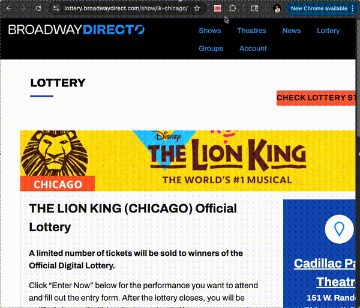

# Broadway Lottery Helper 🎟️

_A simple Chrome extension to autofill Broadway lottery forms and save time._



## Features

- Save your personal info (name, email, birthday, etc.) in the extension.
- One click to open **all available lottery event** and autofill the forms.
- Update your saved info anytime via the popup menu.

## Installation

1. Clone or download this repo:
    ```bash
    git clone https://github.com/binomial14/broadway-lottery-helper.git
    ```
2. Open Google Chrome and go to: `chrome://extensions/`
3. Enable Developer Mode (toggle at top-right).
4. Click Load unpacked and select this project folder.
5. The extension should now appear in your toolbar.

## Usage

1. Click the 🎟️ extension icon.
2. To set/update your information, press `Update Info`, edit, and Save.
3. Press `Fill All Events` → All active lottery forms will open and autofill.

## Notes

1. Only works on lottery.broadwaydirect.com pages.
2. This extension does not bypass reCAPTCHA ("I'm not a robot"). You must check that box and submit the form manually.
3. For personal use only. Not affiliated with Broadway Direct.
